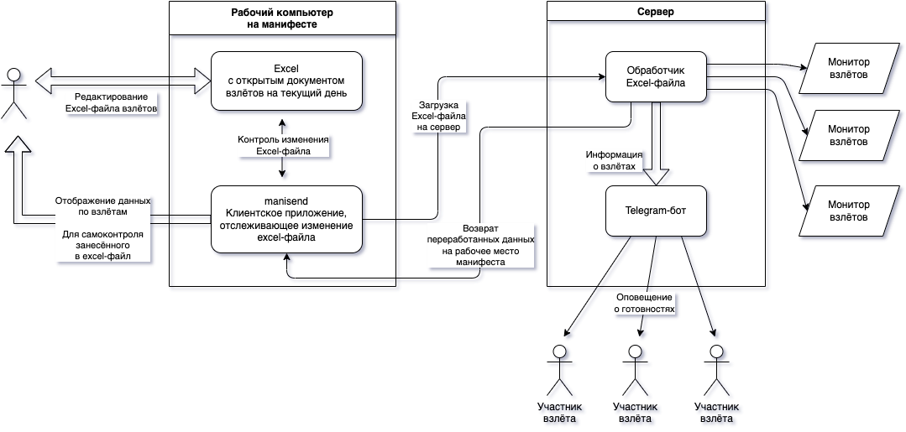

# Монитор взлётов для Дроп-Зон

Данный проект разрабатывался для DZ Vatulino.

Его работа основана на хранении данных в excel-файле на компьютере в манифесте. При этом, в одном файле хранятся данные только за один рабочий денью

Плюсы схемы:

* База всегда находится на манифесте

    Меньше требований к надёжности хранения на сервере.
    
    В случае любых проблем с сервером всегда можно вернуться к ручной записи во взлёт,
    нужен только excel на рабочем компьютере манифеста.

* Единая точка записи во взлёт

    Исключены неожиданности, связанные с синхронизацией отображаемых данных
    на нескольких рабочих местах, откуда возможна запись во взлёт.

* На сервере не сохраняются данные

    Любые данные, которые нужны для отображения на мониторах, хранятся во временной памяти
    и не являются основой рассчётов. Допустимо отношение к этим данным как к ненадёжным.

Минусы, разумеется, так же присутствуют:

* Единая точка записи во взлёт

    Невозможно непосредственно записаться во взлёт откуда-либо, кроме как с рабочего места,
    на котором редактируется excel-файл взлётов.

* Невозможно узнать долги за прошлые дни

    Подсчёт данных возможен только за текущий рабочий день.

## Разделы документации

* [Установка на сервер](doc/INSTALL.md)

    На случай, если была утеряна резервная SD-карта, или Вы хотите настроить всё заного.

* [Создание Telegram-бота](doc/telegrambot.md)

    Если работающего бота вдруг удалили (такое бывает), или по каким-то ещё причинам надо пересоздать другого бота.

* [Формат excel-файла](doc/excelformat.md)

    Критичные моменты в рабочем excel-файле взлётов, на которые опирается данный проект.

* [Клиентское приложение](doc/clientman.md)

    Описание программы, отправляющей рабочий excel-файл на сервер.

* [Описание исходников на серверной стороне](doc/srcserver.md)

    Разбор содержимого для серверной части, если вы планируете дорабатывать проект.

* [Описание исходников клиента](doc/srcclient.md)

    Классы и модули, используемые в клиентском приложении.
