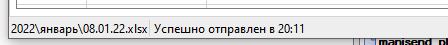
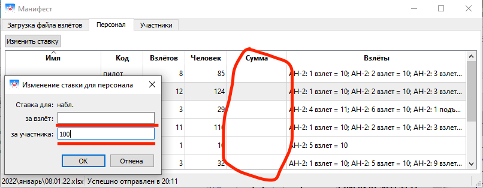

# Краткое руководство пользователя приложением

Функции приложения:

* Основная: автоматическая загрузка excel-файла с рабочего места манифеста на сервер

* Второстепенна: дополнительные данные и интерфейсные удобста на рабочем месте манифеста

После запуска приложения в `Трее` будет обязательно иконка:

* `Правый клик` - меню.

* `Двойной клик` - показать/скрыть главное окно.

## Главное окно

### Закладка "Загрузка файла взлётов"

* Кнопка `Отправить текущий`

    Вручную отправляет текущий excel-файл, выбранный автоматически или вручную.
    
    Отправка происходит автоматически при изменении этого файла.

* Кнопка `Обновить`

    Вручную перечитывает содержимое выбранной рабочей папки с excel-файлами.
    
    Обновление папки происходит автоматически, если не определён текущий excel-файл (автоматически или вручную).

* Кнопка `Папка с файлами`

    Выбор текущей рабочей папки с excel-файлами.
    
    Структура этой папки может быть с любым уровнем вложенности, поиск будет происходить во всех подпапках.

* Галка `Не сохранять`

    Сообщает при отправке серверу, что не надо сохранять данные из отправленного файла, а только обработать их и вернуть результат.
    
    Это может пригодится, если надо временно открыть старые файлы, но не надо, чтобы это повлияло на отображение в мониторе взлётов.

* Таблица с найденными файлами

    В списке все найденные файлы в выбранной папке.
    
    * В колонке `Текущий` - отмечен текущий excel-файл, выбранный автоматически или вручную.
    
        
    
        Именно этот файл будет отправляться вручную или автоматически при изменении.
    
    * В колонке `Авто-Дата` - отображена дата, определённая по имени файла.
    
        Формат имени файла должен быть обязательно: `чч.мм.гг.xlsx`.
    
    * `Двойной клик` - ручной выбор "текущего" файла.
    
    Чтобы сбросить ручной выбор файла в "авто", следует нажать кнопку `Обновить`.

* `Строка статуса`

    

    * Дублерует имя текущего файла.
    
    * Сообщает о времени и статусе отправки текущего файла.

### Закладка "Персонал"

Отображает список всех спец-персон взлётов, в которых есть участники.

Группировка и суммирование данных происходит по полям: `ФИО` и `КОД`.

* Колонка `Взлётов` - сколько всего взлётов с этими `ФИО` и `КОД`.

* Колонка `Человек` - полное число участников всех взлётов с этими `ФИО` и `КОД`.

Для любого варианта поля `КОД` можно указать ставку любым из указанных вариантов:

* `Двойной клик` на строке с этим кодом.

* Кнопка `Изменить ставку` после выбора строки с нужным кодом.

* Клавиши `Enter` или `F2` после выбора строки с нужным кодом.

Результат будет виден в колонке `Сумма`.

### Закладка "Участники"

Сводные данные по всем участников всех взлётов.

Колонка `КОД` участников разделена на две части:

* Буквенную (в начале до пробела)

    Все участники сгруппированы по `ФИО` и буквенной части поля `КОД`.
    
    Выводится в колонке `Код`.

* Числовую (после буквенной через пробел)

    Все числа с одинаковой буквенной частью суммируются и выводятся в колонке `Сумма`.

В поле `КОД` может присутствовать только одна из этих двух частей.

## Монитор взлётов

В этом окне отображается то же самое, что и на всех мониторах взлётов, но без списка участников.

Взлёты с готовностями `15 мин`, `10 мин`, `5 мин` и `На старт!` моргают 30 секунд.
